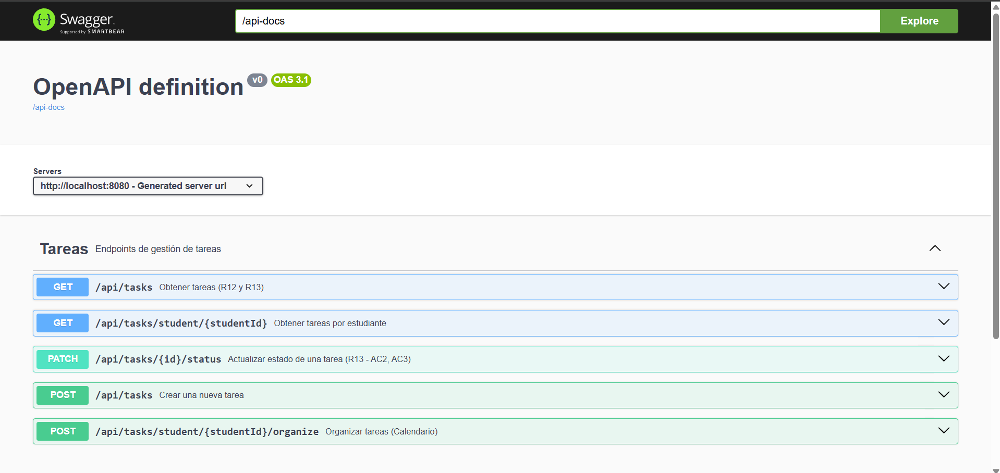

<div align="center">

# 📋 powerpuff-engineers-task-service

### *Gestión Inteligente de Tareas Académicas — A.IBERT ECI Planner*

> Crea, prioriza, organiza automáticamente y visualiza las tareas académicas del estudiante,
> distribuyendo la carga de trabajo de forma inteligente para mejorar su rendimiento y evitar el burnout académico.

---


---

### 🛠️ Stack Tecnológico


### ☁️ Infraestructura & Calidad


### 🏗️ Arquitectura


</div>

---

## 📑 Tabla de Contenidos

1. [👤 Integrantes](#1--integrantes)
2. [🎯 Descripción del Módulo](#2--descripción-del-módulo)
3. [⚙️ Tecnologías Utilizadas](#3-️-tecnologías-utilizadas)
4. [🏗️ Cómo Funciona el Módulo](#4-️-cómo-funciona-el-módulo)
   - [4.1 Módulos con los que se comunica](#41-módulos-con-los-que-se-comunica)
   - [4.2 Patrones utilizados](#42-patrones-utilizados)
   - [4.3 Estilo de arquitectura detallado](#43-estilo-de-arquitectura-detallado)
   - [4.4 Algoritmo de organización automática](#44-algoritmo-de-organización-automática)
5. [📊 Diagramas](#5--diagramas)
   - [5.1 Diagrama de Datos](#51-diagrama-de-datos)
   - [5.2 Diagrama de Clases](#52-diagrama-de-clases)
   - [5.3 Diagrama de Componentes](#53-diagrama-de-componentes)
   - [5.4 Diagrama de Secuencia](#54-diagrama-de-secuencia)
6. [⚡ Funcionalidades](#6--funcionalidades)
   - [6.1 R11 — Crear Tarea](#61-r11--crear-tarea)
   - [6.2 R12 — Organizar Tareas Inteligentemente](#62-r12--organizar-tareas-inteligentemente)
   - [6.3 R13 — Vista Kanban y Calendario](#63-r13--vista-kanban-y-calendario)
   - [6.4 R15 — Editar Tarea](#64-r15--editar-tarea)
   - [6.5 R16 — Eliminar y Restaurar Tarea](#65-r16--eliminar-y-restaurar-tarea)
   - [6.6 R42 — Actualizar Estado de Tarea](#66-r42--actualizar-estado-de-tarea)
   - [6.7 Integración Frontend — Vista Calendario Semanal](#67-integración-frontend--vista-calendario-semanal)
7. [🔌 Conexiones con Servicios Externos](#7--conexiones-con-servicios-externos)
8. [⚠️ Manejo de Errores](#8-️-manejo-de-errores)
9. [📋 Estrategia de Versionamiento y Branches](#9--estrategia-de-versionamiento-y-branches)
   - [9.1 Convenciones para crear ramas](#91-convenciones-para-crear-ramas)
   - [9.2 Convenciones para crear commits](#92-convenciones-para-crear-commits)
10. [🧪 Evidencia de Pruebas Unitarias](#10--evidencia-de-pruebas-unitarias)
11. [📈 Evidencia de Análisis de Cobertura](#11--evidencia-de-análisis-de-cobertura)
12. [🗂️ Código Organizado por Carpetas](#12-️-código-organizado-por-carpetas)
13. [🚀 Cómo Ejecutar el Proyecto](#13--cómo-ejecutar-el-proyecto)
14. [☁️ CI/CD y Despliegue en Azure](#14-️-cicd-y-despliegue-en-azure)
    - [14.1 Pipeline de Desarrollo (DEV)](#141-pipeline-de-desarrollo-dev)
    - [14.2 Pipeline de Producción (PROD)](#142-pipeline-de-producción-prod)
    - [14.3 Evidencia del Despliegue](#143-evidencia-del-despliegue)
    - [14.4 Link Swagger en Azure](#144-link-swagger-en-azure)
15. [🔐 Variables de Entorno](#15--variables-de-entorno)
16. [📚 Referencias](#16--referencias)

---

## 1. 👤 Integrantes

**Módulo 3 — Gestión Inteligente de Tareas Académicas**
**Proyecto:** A.IBERT — ECI Planner
**Institución:** Escuela Colombiana de Ingeniería Julio Garavito

<div align="center">

| 👨‍💻 Integrante              | 🎓 Rol                          |
|-----------------------------|---------------------------------|
| Juan David Valero            | Developer — Backend/Arquitectura |
| Isaac David Burgos           | Developer — Líder               |
| Daniel Felipe Rayo           | Developer — Backend/DevOps      |
| Juan Hernández Moreno        | Developer                       |
| Daniel Peña Bonilla          | Developer                       |

</div>

---

## 2. 🎯 Descripción del Módulo

El **task-service** es el microservicio responsable de todo el ciclo de vida de las tareas académicas de un estudiante dentro del ecosistema **A.IBERT — ECI Planner**.

No se limita a registrar tareas: implementa algoritmos de priorización y distribución temporal para optimizar cómo el estudiante usa su tiempo disponible.

<div align="center">

| ✅ **Qué hace** | ❌ **Problema que resuelve** |
|:---------------|:-----------------------------|
| Registra tareas académicas con validación de materias | Tareas sin estructura ni seguimiento |
| Prioriza automáticamente por urgencia y deadline | Mala priorización (urgente vs. importante) |
| Distribuye tareas en días disponibles (máx. 240 min/día) | Sobrecarga en días específicos |
| Visualiza tareas en Kanban y Calendario | Falta de visibilidad del estado académico |
| Notifica al gamification-service al completar una tarea | Desconexión entre progreso y motivación |

</div>

### Microservicios del Módulo

| Microservicio | Puerto | Responsabilidad |
|---------------|--------|-----------------|
| task-service  | 8084   | Gestión completa de tareas académicas |

---

## 3. ⚙️ Tecnologías Utilizadas

<div align="center">

| **Tecnología / Herramienta** | **Uso principal en el proyecto** |
|------------------------------|----------------------------------|
| **Java 21** | Lenguaje de programación base del microservicio backend. |
| **Spring Boot 3.4** | Framework principal para construir el microservicio REST y gestionar la inyección de dependencias. |
| **Spring Web** | Exposición de endpoints REST bajo la arquitectura hexagonal. |
| **Spring Security** | Configuración de CORS. El JWT es validado por el API Gateway, que inyecta `X-User-Id`. |
| **Spring Data JPA** | Integración con PostgreSQL usando el patrón Repository. |
| **PostgreSQL 16** | Base de datos relacional para persistir las tareas académicas. |
| **Flyway** | Migraciones versionadas de esquema de base de datos. |
| **Apache Maven** | Gestión de dependencias y automatización de builds. |
| **Lombok** | Reducción de código repetitivo con `@Builder`, `@Data`, `@RequiredArgsConstructor`. |
| **MapStruct** | Mapeo declarativo entre capas (dominio ↔ entidad ↔ DTO). |
| **OpenFeign** | Comunicación HTTP declarativa con academic-service y gamification-service. |
| **Resilience4j** | Circuit breaker y fallback para las llamadas a servicios externos. |
| **Eureka Client** | Registro del servicio en el service discovery. |
| **JUnit 5** | Framework de pruebas unitarias para validar lógica de dominio y casos de uso. |
| **Mockito** | Simulación de dependencias (puertos, repositorios) en pruebas unitarias. |
| **H2** | Base de datos en memoria para pruebas de integración. |
| **JaCoCo** | Generación de reportes de cobertura de código. |
| **SonarCloud** | Análisis estático, detección de vulnerabilidades y code smells. |
| **Swagger (OpenAPI 3)** | Documentación interactiva automática de los endpoints REST. |
| **Docker** | Contenedorización del microservicio (multi-stage build JDK → JRE). |
| **Azure App Service** | Entorno de ejecución en la nube para el contenedor Docker. |
| **Azure Container Registry (ACR)** | Almacenamiento de imágenes Docker generadas en CI/CD. |
| **GitHub Actions** | Pipelines de integración y despliegue continuo (CI/CD). |

</div>

> 🧠 **Stack seleccionado** para garantizar **escalabilidad**, **modularidad**, **seguridad** y **mantenibilidad**, aplicando buenas prácticas de ingeniería de software.

---

## 4. 🏗️ Cómo Funciona el Módulo

### 4.1 Módulos con los que se comunica

El `task-service` se integra con otros microservicios del ecosistema A.IBERT vía HTTP REST:

```
task-service
 ├── academic-service     → Valida que la materia (subjectId) existe antes de crear una tarea
 └── gamification-service → Notifica cuando el estudiante completa una tarea
```

<div align="center">

| 🌍 **Microservicio** | ⚙️ **Operación** | 📋 **Propósito** |
|:---------------------|:----------------|:-----------------|
| **academic-service** | `GET /api/v1/subjects/{subjectId}` | Verificar que la materia existe antes de crear la tarea |
| **gamification-service** | `POST /api/v1/events/task-completed` | Notificar que el estudiante completó una tarea (puntos/logros) |
| **API Gateway** | Consume task-service | Valida JWT y reenvía `X-User-Id` como header al servicio |

</div>

> ⚠️ Las llamadas a servicios externos solo están activas con el perfil `feign`. Sin él, se usan stubs que aceptan cualquier input.

### 4.2 Patrones utilizados

<div align="center">

| 🎨 **Patrón** | 📋 **Descripción** |
|:-------------|:-------------------|
| **Ports & Adapters (Hexagonal)** | Separación total entre la lógica de negocio (dominio) y la infraestructura |
| **Repository Pattern** | Abstracción del acceso a datos con JPA (`TaskRepositoryPort`) |
| **Strategy Pattern** | Estrategias intercambiables para el ordenamiento de tareas (`SortCriteriaEnum`) |
| **Builder Pattern** | Construcción legible de objetos complejos vía Lombok `@Builder` |
| **DTO Pattern** | Separación entre objetos de transferencia y entidades de dominio |
| **Adapter Pattern** | Adaptadores intercambiables para repositorio (JPA / InMemory) y validación (Feign / stub) |
| **Circuit Breaker** | Resilience4j protege las llamadas a academic-service y gamification-service |
| **Fallback Pattern** | `AcademicServiceFallback` y `GamificationServiceFallback` ante indisponibilidad |

</div>

### 4.3 Estilo de arquitectura detallado

El microservicio implementa **Clean Architecture** con enfoque **Hexagonal (Ports & Adapters)**:

```
┌─────────────────────────────────────────────────┐
│                  ENTRYPOINTS                    │
│       (TaskController / GlobalExceptionHandler) │
└──────────────────────┬──────────────────────────┘
                       │
┌──────────────────────▼──────────────────────────┐
│                  APPLICATION                    │
│      (Use Cases / TaskDtoMapper / DTOs)         │
└──────────────────────┬──────────────────────────┘
                       │
┌──────────────────────▼──────────────────────────┐
│                    DOMAIN                       │
│  (Task / TaskStatus / TaskPriority / Ports)     │
└──────────────────────┬──────────────────────────┘
                       │
┌──────────────────────▼──────────────────────────┐
│               INFRASTRUCTURE                    │
│  (JPA Adapters / Feign Clients / TaskEntity)    │
└─────────────────────────────────────────────────┘
```

**Flujo de dependencias:** `Entrypoints → Application → Domain ← Infrastructure`

> La capa de **Domain** no depende de ninguna otra; es el núcleo inmutable de la aplicación.

**Puertos de entrada (`in`):** `CreateTaskUseCase` · `GetTasksUseCase` · `GetTasksForViewUseCase` · `UpdateTaskStatusUseCase` · `UpdateTaskUseCase` · `OrganizeTasksUseCase` · `TaskOrganizerUseCase` · `DeleteTaskUseCase` · `RestoreTaskUseCase` · `GetTaskByIdUseCase`

**Puertos de salida (`out`):** `TaskRepositoryPort` · `SubjectValidationPort` · `TaskEventPort`

### 4.4 Algoritmo de organización automática

El organizador asigna `scheduledDate` a las tareas pendientes (`TODO`) siguiendo este proceso:

```
1. Filtrar solo tareas con status = TODO del estudiante
2. Ordenar por prioridad (desc) y deadline (asc)
3. Para cada tarea:
   - Buscar el primer día con capacidad disponible (máx. 240 min/día)
   - Asignar scheduledDate = [día_encontrado] a las 09:00
   - Si todos los días hasta el deadline están llenos → asignar al día del deadline
4. Persistir todas las tareas con scheduledDate asignado
```

**Capacidad diaria:** `240 minutos (4 horas)` de trabajo académico por día.

Si una tarea no tiene `estimatedDurationMinutes`, se asumen **60 minutos** por defecto.

---

## 5. 📊 Diagramas

### 5.1 Diagrama de Datos

> 📌 *Inserta aquí el diagrama de entidad-relación de la base de datos PostgreSQL.*

```
┌───────────────────────────────────────────────┐
│                    TASKS                      │
│───────────────────────────────────────────────│
│ id (PK, UUID)                                 │
│ student_id (NOT NULL, INDEX)                  │
│ subject_id (NOT NULL)                         │
│ title (NOT NULL)                              │
│ description                                   │
│ task_type (TAREA|EXAMEN|PROYECTO|LECTURA|OTRO)│
│ estimated_duration_minutes (> 0)              │
│ deadline (NOT NULL, INDEX)                    │
│ priority (LOW|MEDIUM|HIGH|CRITICAL)           │
│ status (TODO|IN_PROGRESS|COMPLETED, INDEX)    │
│ scheduled_date                                │
│ completed_at                                  │
│ deleted_at                                    │
│ UNIQUE(student_id, subject_id, title)         │
└───────────────────────────────────────────────┘
```

> 📌 *Reemplaza el diagrama ASCII por la imagen real del diagrama de base de datos.*

<div align="center">

</div>

---

### 5.2 Diagrama de Clases

> 📌 *Inserta aquí el diagrama de clases del dominio.*

<div align="center">

</div>

**Resumen del diseño de dominio:**

- **`Task`** — Entidad central del dominio con todos los atributos del ciclo de vida de una tarea académica.
- **`TaskStatus`** — Enum que modela el estado: `TODO → IN_PROGRESS → COMPLETED`.
- **`TaskPriority`** — Enum que define la urgencia: `LOW`, `MEDIUM`, `HIGH`, `CRITICAL`.
- **`TaskType`** — Enum que clasifica la naturaleza: `TAREA`, `EXAMEN`, `PROYECTO`, `LECTURA`, `OTRO`.
- **`SortCriteriaEnum`** — Enum de criterios de ordenamiento: `PRIORITY`, `DEADLINE`, `SUBJECT`.

---

### 5.3 Diagrama de Componentes

> 📌 *Inserta aquí el diagrama de componentes del microservicio.*

<div align="center">

</div>

**Flujo principal:**

- **`TaskController`** → Recibe solicitudes HTTP y delega en los puertos de entrada (`UseCase`).
- **`CreateTaskUseCaseImpl`** → Valida la materia (vía `SubjectValidationPort`), verifica duplicados y persiste.
- **`OrganizeTasksUseCaseImpl`** → Filtra tareas `TODO`, las ordena y les asigna `scheduledDate`.
- **`TaskRepositoryAdapter`** → Traduce entre el dominio y JPA (`TaskEntity`) para PostgreSQL.
- **`SubjectServiceFeignAdapter`** → Llama a academic-service para validar que la materia existe.
- **`GamificationServiceFeignAdapter`** → Notifica a gamification-service cuando se completa una tarea.

---

### 5.4 Diagrama de Secuencia

> 📌 *Inserta aquí los diagramas de secuencia por funcionalidad.*

<div align="center">

</div>

---

## 6. ⚡ Funcionalidades

---

### 6.1 R11 — Crear Tarea

Registra una nueva tarea académica para el estudiante autenticado. Valida que la materia exista en `academic-service` (perfil `feign`) y que no haya una tarea con el mismo título para esa misma materia.

**Endpoint:**
`POST /api/tasks`

---

#### 📦 Información de Entrada (Request)

<div align="center">

| 🏷️ Campo | 🗃️ Tipo | ⚠️ Restricciones | 📝 Descripción |
|---|---|:---:|---|
| `X-User-Id` | `String` | Obligatorio (Header) | ID del estudiante, inyectado por el API Gateway. |
| `title` | `String` | Obligatorio, no vacío | Título de la tarea. |
| `description` | `String` | Opcional | Descripción detallada. |
| `taskType` | `Enum` | Obligatorio | `TAREA`, `EXAMEN`, `PROYECTO`, `LECTURA`, `OTRO`. |
| `estimatedDurationMinutes` | `Integer` | Opcional, > 0 | Duración estimada en minutos. |
| `deadline` | `LocalDateTime` | Obligatorio, fecha futura | Fecha límite de entrega. |
| `priority` | `Enum` | Opcional | `LOW`, `MEDIUM`, `HIGH`, `CRITICAL`. Default: `MEDIUM`. |
| `subjectId` | `String` | Obligatorio, no vacío | ID de la materia (validado contra academic-service). |

</div>

---

#### 📦 Información de Salida (Response)

<div align="center">

| 🏷️ Campo | 🗃️ Tipo | 📝 Descripción |
|---|---|---|
| `id` | `String` (UUID) | ID único generado para la tarea. |
| `studentId` | `String` | ID del estudiante propietario. |
| `subjectId` | `String` | ID de la materia asociada. |
| `title` | `String` | Título de la tarea. |
| `description` | `String` | Descripción (puede ser null). |
| `taskType` | `String` | Tipo de tarea. |
| `estimatedDurationMinutes` | `Integer` | Minutos estimados. |
| `deadline` | `LocalDateTime` | Fecha límite. |
| `priority` | `String` | Prioridad asignada. |
| `status` | `String` | `TODO` (valor por defecto al crear). |
| `scheduledDate` | `LocalDateTime` | `null` hasta ejecutar el organizador. |
| `completedAt` | `LocalDateTime` | `null` hasta marcar como COMPLETED. |

</div>

---

#### ✅ Happy Path (Ejemplo de Uso Exitoso)

**Request:**
```http
POST /api/tasks
X-User-Id: STU-001
Content-Type: application/json

{
  "title": "Parcial de Cálculo Diferencial",
  "description": "Capítulos 3 y 4",
  "taskType": "EXAMEN",
  "estimatedDurationMinutes": 180,
  "deadline": "2026-05-20T10:00:00",
  "priority": "HIGH",
  "subjectId": "SUB-MAT-01"
}
```

**Response `201 Created`:**
```json
{
  "id": "550e8400-e29b-41d4-a716-446655440000",
  "studentId": "STU-001",
  "subjectId": "SUB-MAT-01",
  "title": "Parcial de Cálculo Diferencial",
  "description": "Capítulos 3 y 4",
  "taskType": "EXAMEN",
  "estimatedDurationMinutes": 180,
  "deadline": "2026-05-20T10:00:00",
  "priority": "HIGH",
  "status": "TODO",
  "scheduledDate": null,
  "completedAt": null
}
```

---

#### 📊 Tipos de Errores Manejados

<div align="center">

| 🔢 **Código HTTP** | ⚠️ **Escenario** | 💬 **Mensaje de Error** |
|:------------------:|:----------------|:------------------------|
|  | Campos inválidos o faltantes | `{ "title": "Title is required" }` |
|  | Materia no encontrada en academic-service | `{ "message": "Subject not found: SUB-MAT-01" }` |
|  | Tarea duplicada (mismo título + materia) | `{ "message": "Task with this title already exists for this subject" }` |
|  | academic-service no disponible | `{ "message": "External service unavailable" }` |

</div>

---

### 6.2 R12 — Organizar Tareas Inteligentemente

Distribuye automáticamente las tareas pendientes (`TODO`) del estudiante en los días disponibles, asignando una `scheduledDate` a cada una según su prioridad, deadline y duración estimada. Respeta un máximo de **240 minutos de trabajo académico por día**.

**Endpoint:**
`POST /api/tasks/student/{studentId}/organize`

---

#### 📦 Información de Entrada (Request)

<div align="center">

| 🏷️ Campo | 🗃️ Tipo | ⚠️ Restricciones | 📝 Descripción |
|---|---|:---:|---|
| `X-User-Id` | `String` | Obligatorio (Header) | Debe coincidir con `studentId` del path. |
| `studentId` | `String` | Obligatorio (Path) | ID del estudiante cuyas tareas se organizarán. |

</div>

---

#### 📦 Información de Salida (Response)

Lista completa de tareas del estudiante (`List<TaskResponse>`) con `scheduledDate` asignado en las tareas `TODO`.

---

#### ✅ Happy Path (Ejemplo de Uso Exitoso)

**Request:**
```http
POST /api/tasks/student/STU-001/organize
X-User-Id: STU-001
```

**Response `200 OK`:**
```json
[
  {
    "id": "550e8400-e29b-41d4-a716-446655440000",
    "title": "Parcial de Cálculo Diferencial",
    "priority": "HIGH",
    "status": "TODO",
    "scheduledDate": "2026-05-16T09:00:00",
    "deadline": "2026-05-20T10:00:00",
    "estimatedDurationMinutes": 180
  },
  {
    "id": "6ba7b810-9dad-11d1-80b4-00c04fd430c8",
    "title": "Taller de Programación",
    "priority": "MEDIUM",
    "status": "TODO",
    "scheduledDate": "2026-05-16T09:00:00",
    "deadline": "2026-05-22T23:59:00",
    "estimatedDurationMinutes": 60
  }
]
```

---

#### 📊 Tipos de Errores Manejados

<div align="center">

| 🔢 **Código HTTP** | ⚠️ **Escenario** | 💬 **Mensaje de Error** |
|:------------------:|:----------------|:------------------------|
|  | `X-User-Id` ≠ `studentId` del path | `{ "message": "No tienes permiso para organizar las tareas de otro estudiante" }` |

</div>

---

### 6.3 R13 — Vista Kanban y Calendario

Retorna las tareas del estudiante en diferentes formatos de visualización según el parámetro `view`. Soporta tres modos: lista ordenada, Kanban (agrupado por estado) y Calendario (filtrado por rango de fechas).

**Endpoint:**
`GET /api/tasks`

---

#### 📦 Información de Entrada (Request)

<div align="center">

| 🏷️ Campo | 🗃️ Tipo | ⚠️ Restricciones | 📝 Descripción |
|---|---|:---:|---|
| `X-User-Id` | `String` | Obligatorio (Header) | ID del estudiante autenticado. |
| `view` | `String` | Opcional (Query) | `kanban` o `calendar`. Sin este param retorna lista ordenada. |
| `sortBy` | `Enum` | Opcional (Query) | `PRIORITY`, `DEADLINE`, `SUBJECT`. Solo aplica sin `view`. |
| `status` | `Enum` | Opcional (Query) | `TODO`, `IN_PROGRESS`, `COMPLETED`. Solo con `view=calendar`. |
| `startDate` | `LocalDateTime` | Opcional (Query, ISO) | Inicio del rango. Solo con `view=calendar`. |
| `endDate` | `LocalDateTime` | Opcional (Query, ISO) | Fin del rango. Solo con `view=calendar`. |
| `subjectId` | `String` | Opcional (Query) | Filtro por materia. Solo con `view=calendar`. |
| `taskType` | `Enum` | Opcional (Query) | Filtro por tipo. Solo con `view=calendar`. |

</div>

---

#### 📦 Información de Salida (Response)

**Sin `view`:** `List<TaskResponse>` ordenada por criterio `sortBy`.

**Con `view=kanban`:**

<div align="center">

| 🏷️ Campo | 🗃️ Tipo | 📝 Descripción |
|---|---|---|
| `todo` | `List<TaskResponse>` | Tareas en estado `TODO`. |
| `inProgress` | `List<TaskResponse>` | Tareas en estado `IN_PROGRESS`. |
| `completed` | `List<TaskResponse>` | Tareas en estado `COMPLETED`. |

</div>

**Con `view=calendar`:** `List<TaskResponse>` filtrada por los parámetros de rango y tipo indicados.

---

#### ✅ Happy Path — Vista Kanban

**Request:**
```http
GET /api/tasks?view=kanban
X-User-Id: STU-001
```

**Response `200 OK`:**
```json
{
  "todo": [
    {
      "id": "550e8400-...",
      "title": "Parcial de Cálculo",
      "priority": "HIGH",
      "status": "TODO",
      "deadline": "2026-05-20T10:00:00"
    }
  ],
  "inProgress": [
    {
      "id": "6ba7b810-...",
      "title": "Taller de Programación",
      "priority": "MEDIUM",
      "status": "IN_PROGRESS",
      "deadline": "2026-05-22T23:59:00"
    }
  ],
  "completed": []
}
```

---

#### ✅ Happy Path — Vista Calendario

**Request:**
```http
GET /api/tasks?view=calendar&startDate=2026-05-15T00:00:00&endDate=2026-05-22T23:59:00
X-User-Id: STU-001
```

**Response `200 OK`:** `List<TaskResponse>` filtrada por el rango de fechas y parámetros adicionales.

---

### 6.4 R15 — Editar Tarea

Actualiza los campos editables de una tarea existente. Solo el propietario puede editarla y las tareas con estado `COMPLETED` no pueden modificarse. Si `scheduledDate` genera conflicto con otra tarea del mismo estudiante, retorna `409` con la fecha sugerida.

**Endpoint:**
`PUT /api/tasks/{id}` (actualización completa) · `PATCH /api/tasks/{id}` (actualización parcial)

---

#### 📦 Información de Entrada (Request)

<div align="center">

| 🏷️ Campo | 🗃️ Tipo | ⚠️ Restricciones | 📝 Descripción |
|---|---|:---:|---|
| `id` | `String` | Obligatorio (Path) | ID de la tarea a editar. |
| `X-User-Id` | `String` | Obligatorio (Header) | Debe ser el propietario de la tarea. |
| `title` | `String` | Opcional | No vacío si se provee. |
| `description` | `String` | Opcional | — |
| `subjectId` | `String` | Opcional | No vacío si se provee. |
| `taskType` | `Enum` | Opcional | `TAREA`, `EXAMEN`, `PROYECTO`, `LECTURA`, `OTRO`. |
| `deadline` | `LocalDateTime` | Opcional, fecha futura | — |
| `priority` | `Enum` | Opcional | `LOW`, `MEDIUM`, `HIGH`, `CRITICAL`. |
| `estimatedDurationMinutes` | `Integer` | Opcional, > 0 | — |
| `scheduledDate` | `LocalDateTime` | Opcional, presente o futura | Genera `409` si solapa con otra tarea. |

</div>

---

#### 📦 Información de Salida (Response)

`200 OK` con `TaskResponse` actualizado.

---

#### 📊 Tipos de Errores Manejados

<div align="center">

| 🔢 **Código HTTP** | ⚠️ **Escenario** | 💬 **Mensaje de Error** |
|:------------------:|:----------------|:------------------------|
|  | Tarea completada / campos inválidos | `{ "message": "..." }` |
|  | No es el propietario | `{ "message": "..." }` |
|  | Tarea no encontrada | `{ "message": "Task not found: {id}" }` |
|  | `scheduledDate` solapada con otra tarea | Incluye `suggestedDate` en la respuesta |

</div>

---

### 6.5 R16 — Eliminar y Restaurar Tarea

**Eliminar (soft-delete):** Marca la tarea como eliminada asignando `deletedAt`. Deja de aparecer en cualquier listado. Solo el propietario puede eliminarla.

**Restaurar:** Limpia `deletedAt`, haciendo la tarea visible de nuevo. Solo el propietario puede restaurarla.

**Endpoints:**
`DELETE /api/tasks/{id}` — Eliminar
`PATCH /api/tasks/{id}/restore` — Restaurar

---

#### 📦 Información de Entrada

<div align="center">

| 🏷️ Campo | 🗃️ Tipo | ⚠️ Restricciones | 📝 Descripción |
|---|---|:---:|---|
| `id` | `String` | Obligatorio (Path) | ID de la tarea. |
| `X-User-Id` | `String` | Obligatorio (Header) | Debe ser el propietario de la tarea. |

</div>

**Respuesta eliminar:** `204 No Content`

**Respuesta restaurar:** `200 OK` con `TaskResponse` restaurado.

---

#### 📊 Tipos de Errores Manejados

<div align="center">

| 🔢 **Código HTTP** | ⚠️ **Escenario** |
|:------------------:|:----------------|
|  | No es el propietario de la tarea |
|  | Tarea no encontrada (o no eliminada para el caso de restaurar) |

</div>

---

### 6.6 R42 — Actualizar Estado de Tarea

Cambia el ciclo de vida de la tarea: `TODO → IN_PROGRESS → COMPLETED`. Al marcar como `COMPLETED`, se registra automáticamente `completedAt` y se notifica al `gamification-service` (perfil `feign`).

**Endpoint:**
`PATCH /api/tasks/{id}/status`

---

#### 📦 Información de Entrada (Request)

<div align="center">

| 🏷️ Campo | 🗃️ Tipo | ⚠️ Restricciones | 📝 Descripción |
|---|---|:---:|---|
| `id` | `String` | Obligatorio (Path) | ID de la tarea. |
| `X-User-Id` | `String` | Obligatorio (Header) | Debe ser el propietario de la tarea. |
| `status` | `Enum` | Obligatorio (Body) | `TODO`, `IN_PROGRESS`, `COMPLETED`. |

</div>

---

#### ✅ Happy Path (Ejemplo de Uso Exitoso)

**Request:**
```http
PATCH /api/tasks/550e8400-e29b-41d4-a716-446655440000/status
X-User-Id: STU-001
Content-Type: application/json

{ "status": "COMPLETED" }
```

**Response `200 OK`:**
```json
{
  "id": "550e8400-e29b-41d4-a716-446655440000",
  "title": "Parcial de Cálculo Diferencial",
  "priority": "HIGH",
  "status": "COMPLETED",
  "completedAt": "2026-05-15T14:30:00",
  "scheduledDate": "2026-05-15T09:00:00"
}
```

---

#### 📊 Tipos de Errores Manejados

<div align="center">

| 🔢 **Código HTTP** | ⚠️ **Escenario** | 💬 **Mensaje de Error** |
|:------------------:|:----------------|:------------------------|
|  | Estado inválido o faltante | `{ "status": "must not be null" }` |
|  | No es el propietario | `{ "message": "..." }` |
|  | Tarea no encontrada | `{ "message": "Task not found: {id}" }` |

</div>

---

### 6.7 Integración Frontend — Vista Calendario Semanal

Esta sección documenta el mapeo exacto entre cada elemento de la **UI del frontend** (vista "Semana N") y los **endpoints / campos del task-service**, para facilitar la integración.

<div align="center">

</div>

---

#### 🗓️ Cargar la semana (bloques del calendario)

**Endpoint:**
```http
GET /api/tasks?view=calendar&startDate=2024-10-14T00:00:00&endDate=2024-10-20T23:59:59
X-User-Id: {studentId}
```

Cada tarea del array retornado se renderiza como un **bloque de tiempo** en el día de `scheduledDate`.

<div align="center">

| 🖥️ **Elemento UI** | 🗃️ **Campo del API** | 📝 **Notas** |
|:-------------------|:---------------------|:------------|
| Título del bloque (`"Examen: Cálculo III"`) | `task.title` | El frontend muestra el `title` de la tarea directamente. |
| Hora de inicio (`10:00`) | `task.scheduledDate` | Extraer la hora: `scheduledDate.toLocalTime()`. |
| Hora de fin (`12:00`) | Calculado por el frontend | `endTime = scheduledDate + estimatedDurationMinutes` (ej: 10:00 + 120 min = 12:00). |
| Día de la columna (`MAR 15`) | `task.scheduledDate` | Extraer la fecha: `scheduledDate.toLocalDate()`. |
| Badge `ALTA PRIORIDAD` | `task.priority == "HIGH"` | Ver tabla de mapeo de prioridades abajo. |
| Badge `CRÍTICO` | `task.priority == "CRITICAL"` | Ver tabla de mapeo de prioridades abajo. |
| Color del bloque | `task.taskType` | Ver tabla de mapeo de colores abajo. |

</div>

> ⚠️ **Nota importante:** `TaskResponse` devuelve `subjectId` (UUID), **no el nombre de la materia**. Si el frontend necesita mostrar el nombre de la asignatura, debe resolverlo llamando a `academic-service: GET /api/v1/subjects/{subjectId}` o mantener un cache local de materias.

---

#### 🏷️ Mapeo de prioridades → etiquetas visuales

<div align="center">

| 🔢 **Valor API (`priority`)** | 🖥️ **Etiqueta en UI** | 🎨 **Color sugerido** |
|:------------------------------|:----------------------|:----------------------|
| `LOW` | Sin badge | Gris |
| `MEDIUM` | Sin badge | Gris |
| `HIGH` | `ALTA PRIORIDAD` | Naranja / Amarillo |
| `CRITICAL` | `CRÍTICO` | Rojo |

</div>

---

#### 🎨 Mapeo de tipos de tarea → categorías del gráfico "Distribución de Carga"

El gráfico de distribución (Estudio / Práctica / Descanso) se **calcula en el frontend** a partir de los datos de la semana:

<div align="center">

| 🗃️ **`taskType` del API** | 📊 **Categoría UI** | 📐 **Cálculo** |
|:--------------------------|:--------------------|:---------------|
| `TAREA`, `LECTURA`, `EXAMEN` | **Estudio** | Suma de `estimatedDurationMinutes` de estas tareas en la semana |
| `PROYECTO`, `OTRO` | **Práctica** | Suma de `estimatedDurationMinutes` de estas tareas en la semana |
| *(sin tarea asignada)* | **Descanso** | `Tiempo restante = 240 min/día × días - (Estudio + Práctica)` |

</div>

---

#### 🔘 Botón **"Regenerar"**

Llama al organizador automático para redistribuir las tareas `TODO` de la semana actual:

```http
POST /api/tasks/student/{studentId}/organize
X-User-Id: {studentId}
```

El endpoint **persiste inmediatamente** los nuevos `scheduledDate`. El frontend puede usar la respuesta para re-renderizar el calendario sin necesidad de un segundo GET.

> 💡 El mensaje de AIbert ("Se han reorganizado 2 sesiones...") es generado localmente por el frontend comparando la lista antes y después del POST.

---

#### ✅ Botón **"Confirmar"**

El endpoint `/organize` ya guarda los cambios de forma permanente. El botón **"Confirmar"** es una **acción de UI únicamente**: el frontend descarta el estado previo y da por válidos los `scheduledDate` recibidos del POST. **No requiere llamada adicional al backend.**

---

#### 📅 Ejemplo completo de flujo semanal

```
1. Usuario abre la vista "Semana 12"
   → GET /api/tasks?view=calendar
              &startDate=2024-10-14T00:00:00
              &endDate=2024-10-20T23:59:59
   ← Lista de TaskResponse con scheduledDate en esa semana

2. Frontend calcula bloques:
   Para cada tarea:
     column = scheduledDate.toLocalDate()      // día de la semana
     startTime = scheduledDate.toLocalTime()   // hora de inicio
     endTime = startTime + estimatedDurationMinutes  // hora fin

3. Usuario hace click en "Regenerar"
   → POST /api/tasks/student/{studentId}/organize
   ← Lista actualizada con nuevos scheduledDate

4. Frontend compara listas y muestra "Se han reorganizado N sesiones"
   → Usuario hace click en "Confirmar" (solo UI, no HTTP)

5. Usuario marca una tarea como completada (click en el bloque)
   → PATCH /api/tasks/{id}/status  { "status": "COMPLETED" }
   ← TaskResponse con completedAt registrado
```

---

## 7. 🔌 Conexiones con Servicios Externos

El microservicio se comunica con servicios externos a través de **Feign Clients** HTTP REST:

<div align="center">

| 🌍 **Servicio Externo** | 🔗 **Tipo de Conexión** | ⚙️ **Operación** | 📋 **Propósito** |
|:------------------------|:------------------------|:----------------|:-----------------|
| **academic-service** | Feign Client HTTP | `GET /api/v1/subjects/{subjectId}` | Validar que la materia existe antes de crear una tarea |
| **gamification-service** | Feign Client HTTP | `POST /api/v1/events/task-completed` | Notificar que el estudiante completó una tarea |
| **API Gateway** | HTTP REST (entrante) | Todos los endpoints | Valida JWT y reenvía `X-User-Id` al task-service |
| **Eureka Server** | Eureka Client | Registro automático | Service discovery para la infraestructura |

</div>

### Configuración de Feign Clients

```java
@FeignClient(
    name = "academic-service",
    url = "${clients.academic-service.url}",
    fallback = AcademicServiceFallback.class
)
public interface AcademicServiceClient {
    @GetMapping("/api/v1/subjects/{subjectId}")
    SubjectDTO getSubjectById(@PathVariable("subjectId") String subjectId);
}

@FeignClient(
    name = "gamification-service",
    url = "${clients.gamification-service.url}",
    fallback = GamificationServiceFallback.class
)
public interface GamificationServiceClient {
    @PostMapping("/api/v1/events/task-completed")
    void notifyTaskCompleted(@RequestBody TaskCompletedEventDTO event);
}
```

> ⚠️ **Nota:** El task-service **NO valida JWT** directamente. El API Gateway valida el token y reenvía únicamente el header `X-User-Id`.

### Resiliencia con Circuit Breaker

| Servicio | Fallback | Comportamiento en fallo |
|---------|----------|------------------------|
| **academic-service** | `AcademicServiceFallback` → retorna `null` | `SubjectServiceFeignAdapter` lanza `SubjectNotFoundException` |
| **gamification-service** | `GamificationServiceFallback` → no-op | La completación se registra igual; la notificación se omite silenciosamente |

---

## 8. ⚠️ Manejo de Errores

El microservicio implementa un **mecanismo centralizado de manejo de errores** mediante `@RestControllerAdvice` en `GlobalExceptionHandler`.

### Estructura de Error Estandarizada

```json
{
  "message": "Task not found: 550e8400-e29b-41d4-a716-446655440000"
}
```

### Excepciones del Dominio

| Excepción | Código HTTP | Descripción |
|-----------|-------------|-------------|
| `TaskNotFoundException` | `404` | Tarea no encontrada por ID |
| `SubjectNotFoundException` | `404` | Materia no encontrada en academic-service |
| `TaskConflictException` | `409` | Duplicado o conflicto de `scheduledDate` |
| `TaskForbiddenException` | `403` | El estudiante no es propietario de la tarea |
| `TaskEditNotAllowedException` | `400` | Intento de editar una tarea completada |
| `ExternalServiceUnavailableException` | `503` | Servicio externo no disponible |
| `MethodArgumentNotValidException` | `400` | Fallo de validación Bean Validation (`@Valid`) |
| `FeignException` (no-404) | `502` | Error inesperado al comunicarse con servicio externo |

### Beneficios del Manejo Centralizado

<div align="center">

| 🎯 **Beneficio** | 📋 **Descripción** |
|:-----------------|:-------------------|
| **🎯 Uniformidad** | Todas las respuestas de error tienen el mismo formato JSON |
| **🔧 Mantenibilidad** | Agregar nuevas excepciones no requiere modificar cada controlador |
| **🔒 Seguridad** | Oculta stack traces y detalles internos del servidor |
| **📍 Trazabilidad** | Cada excepción de dominio tiene un handler específico |
| **🤝 Integración** | Facilita la comunicación con frontends y herramientas como Postman/Swagger |

</div>

---

## 9. 📋 Estrategia de Versionamiento y Branches

El equipo utiliza **GitFlow** como modelo de ramificación para el control de versiones.

### Ramas y propósito

#### `main`
- **Propósito:** Rama **estable** con la versión final lista para producción.
- **Reglas:** Solo recibe merges desde `release/*` y `hotfix/*`. Cada merge crea un **tag** SemVer (`vX.Y.Z`). Rama **protegida**: PR obligatorio con aprobaciones y CI en verde.

#### `develop`
- **Propósito:** Integración continua de trabajo; base de nuevas funcionalidades.
- **Reglas:** Recibe merges desde `feature/*` y `release/*`. Protegida de la misma forma que `main`.

#### `feature/*`
- **Propósito:** Desarrollo de una funcionalidad específica.
- **Base:** `develop`. **Cierre:** Merge a `develop` mediante PR.

#### `release/*`
- **Propósito:** Congelar cambios para estabilizar antes del deploy.
- **Base:** `develop`. **Cierre:** Merge a `main` (crear **tag**) y merge a `develop`.
- **Ejemplo:** `release/1.0.0`

#### `hotfix/*`
- **Propósito:** Corregir bugs **críticos** en `main`.
- **Base:** `main`. **Cierre:** Merge a `main` (crear **tag PATCH**) y merge a `develop`.
- **Ejemplo:** `hotfix/fix-task-duplicate-validation`

---

### 9.1 Convenciones para crear ramas

#### `feature/*`
**Formato:**
```
feature/[nombre-funcionalidad]-AIBERT_[codigo-jira]
```
**Ejemplos:**
- `feature/create-task-AIBERT-11`
- `feature/organize-tasks-AIBERT-12`
- `feature/kanban-calendar-view-AIBERT-13`

**Reglas:**
- Usar **kebab-case**
- Máximo 50 caracteres
- Código de Jira obligatorio para trazabilidad

#### `release/*`
```
release/[version]
```
**Ejemplo:** `release/1.0.0`

#### `hotfix/*`
```
hotfix/[descripcion-breve-del-fix]
```
**Ejemplo:** `hotfix/fix-duplicate-task-conflict`

---

### 9.2 Convenciones para crear commits

**Formato:**
```
[codigo-jira] [tipo]: [descripción específica de la acción]
```

**Tipos de commit:**
- `feat`: Nueva funcionalidad
- `fix`: Corrección de errores
- `docs`: Cambios en documentación
- `test`: Adición o corrección de pruebas
- `refactor`: Refactorización de código

**Ejemplos:**
```
AIBERT-11 feat: implementar caso de uso CreateTask con validación de materia
AIBERT-12 feat: algoritmo de organización automática con capacidad 240 min/día
AIBERT-13 feat: agregar vistas kanban y calendario al endpoint GET /api/tasks
AIBERT-11 fix: corregir validación de duplicados por (studentId, subjectId, title)
AIBERT-12 test: pruebas unitarias para OrganizeTasksUseCaseImpl
```

---

## 10. 🧪 Evidencia de Pruebas Unitarias

El microservicio implementa una **estrategia integral de pruebas** con JUnit 5 y Mockito.

### Tipos de pruebas implementadas

<div align="center">

| 🧪 **Tipo de Prueba** | 📋 **Descripción** | 🛠️ **Herramientas** |
|:---------------------|:-------------------|:--------------------|
| **Pruebas Unitarias** | Validan el funcionamiento aislado de los casos de uso, mappers y lógica de dominio |   |
| **Pruebas de Integración** | Verifican el controlador REST y la capa de persistencia con H2 |   |
| **Cobertura de Código** | Mide el porcentaje de código cubierto por las pruebas |  |

</div>

### Clases de test implementadas

| Clase de Test | Cobertura |
|---------------|-----------|
| `CreateTaskUseCaseImplTest` | Crear tarea, validación de materia, duplicados |
| `DeleteTaskUseCaseImplTest` | Soft-delete, validación de propietario |
| `RestoreTaskUseCaseImplTest` | Restaurar tarea eliminada |
| `GetTaskByIdUseCaseImplTest` | Obtener tarea por ID |
| `GetTasksUseCaseImplTest` | Listar tareas por estudiante |
| `GetTasksForViewUseCaseImplTest` | Vistas kanban y calendario |
| `OrganizeTasksUseCaseImplTest` | Algoritmo de organización automática |
| `UpdateTaskStatusUseCaseImplTest` | Cambio de estado y registro de completedAt |
| `UpdateTaskUseCaseImplTest` | Edición de campos y conflictos de fecha |
| `TaskOrganizerServiceImplTest` | Ordenamiento por criterios |
| `TaskControllerTest` | Pruebas del controlador REST con MockMvc |
| `InMemoryTaskRepositoryTest` | Repositorio en memoria |
| `TaskEntityMapperTest` | Mapper entidad ↔ dominio |
| `TaskDtoMapperTest` | Mapper DTO ↔ dominio |
| `GlobalExceptionHandlerTest` | Manejo centralizado de errores |
| `DomainExceptionsTest` | Excepciones de dominio |
| `TaskModelTest` | Modelo de dominio `Task` |
| `TaskEntityTest` | Entidad JPA `TaskEntity` |
| `SubjectServiceFeignAdapterTest` | Adaptador Feign de validación de materias |
| `OpenApiConfigTest` | Configuración de Swagger |

### Cómo ejecutar las pruebas

#### 1️⃣ Ejecutar todas las pruebas

```bash
./mvnw clean test
```

#### 2️⃣ Generar reporte de cobertura con JaCoCo

```bash
./mvnw clean verify
```

El reporte HTML se generará en:
```
target/site/jacoco/index.html
```

#### 3️⃣ Ejecutar una prueba específica

```bash
./mvnw test -Dtest=CreateTaskUseCaseImplTest
```

#### 4️⃣ Ejecutar pruebas desde IntelliJ IDEA

1. Click derecho sobre la carpeta `src/test/java`
2. Selecciona **"Run 'Tests in...'"**
3. Ver resultados en el panel inferior

---

### Ejemplo de prueba unitaria

```java
@ExtendWith(MockitoExtension.class)
class CreateTaskUseCaseImplTest {

    @InjectMocks
    private CreateTaskUseCaseImpl createTaskUseCase;

    @Mock
    private TaskRepositoryPort taskRepositoryPort;

    @Mock
    private SubjectValidationPort subjectValidationPort;

    @Test
    @DisplayName("Should create task successfully when subject exists and no duplicate")
    void createTask_ValidInput_ShouldReturnCreatedTask() {
        // Given
        Task taskToCreate = Task.builder()
                .studentId("STU-001")
                .title("Parcial de Cálculo")
                .subjectId("SUB-MAT-01")
                .taskType(TaskType.EXAMEN)
                .deadline(LocalDateTime.now().plusDays(5))
                .estimatedDurationMinutes(180)
                .build();

        when(subjectValidationPort.exists("SUB-MAT-01")).thenReturn(true);
        when(taskRepositoryPort.existsByStudentIdAndSubjectIdAndTitle(any(), any(), any()))
                .thenReturn(false);
        when(taskRepositoryPort.save(any())).thenReturn(taskToCreate);

        // When
        Task result = createTaskUseCase.createTask(taskToCreate);

        // Then
        assertThat(result.getStatus()).isEqualTo(TaskStatus.TODO);
        assertThat(result.getPriority()).isEqualTo(TaskPriority.MEDIUM);
        verify(taskRepositoryPort).save(any());
    }
}
```

---

### Ejemplo de prueba de integración

```java
@WebMvcTest(TaskController.class)
class TaskControllerTest {

    @Autowired
    private MockMvc mockMvc;

    @MockBean
    private CreateTaskUseCase createTaskUseCase;

    @Test
    @DisplayName("Should return 201 when task is created successfully")
    void createTask_ValidRequest_ShouldReturn201() throws Exception {
        // Given
        Task createdTask = Task.builder()
                .id("550e8400-e29b-41d4-a716-446655440000")
                .studentId("STU-001")
                .title("Parcial de Cálculo")
                .status(TaskStatus.TODO)
                .build();

        when(createTaskUseCase.createTask(any())).thenReturn(createdTask);

        // When & Then
        mockMvc.perform(post("/api/tasks")
                        .header("X-User-Id", "STU-001")
                        .contentType(MediaType.APPLICATION_JSON)
                        .content("""
                            {
                              "title": "Parcial de Cálculo",
                              "taskType": "EXAMEN",
                              "estimatedDurationMinutes": 180,
                              "deadline": "2026-06-01T10:00:00",
                              "priority": "HIGH",
                              "subjectId": "SUB-MAT-01"
                            }
                        """))
                .andExpect(status().isCreated())
                .andExpect(jsonPath("$.id").value("550e8400-e29b-41d4-a716-446655440000"))
                .andExpect(jsonPath("$.status").value("TODO"));
    }
}
```

---

### Evidencias de ejecución

> 📌 *Inserta aquí las capturas de pantalla de las pruebas ejecutándose.*

**1. Consola mostrando pruebas ejecutadas exitosamente:**

<div align="center">

</div>

**2. Vista del panel de pruebas en IntelliJ IDEA:**

<div align="center">

</div>

---

### Criterios de aceptación de pruebas

- ✅ **Cobertura mínima del 80%** en servicios y lógica de negocio
- ✅ **Todas las pruebas en estado PASSED** (sin fallos)
- ✅ **Cero errores de compilación** en el código de pruebas
- ✅ **Pruebas de casos felices y casos de error** implementadas

---

## 11. 📈 Evidencia de Análisis de Cobertura

El análisis de cobertura se realiza con **JaCoCo** y se integra con **SonarCloud** para el análisis estático de calidad.

### Reporte JaCoCo

> 📌 *Inserta aquí la captura del reporte JaCoCo generado.*

<div align="center">

</div>

### Análisis SonarCloud

> 📌 *Inserta aquí la captura del análisis de SonarCloud.*

<div align="center">

</div>

<div align="center">

| 📊 **Métrica** | 🎯 **Objetivo** | ✅ **Resultado** |
|:--------------|:---------------|:----------------|
| Cobertura de líneas | ≥ 80% | **90%** |
| Cobertura de ramas | ≥ 65% | **68%** |
| Cobertura de métodos | ≥ 80% | **94%** |
| Bugs críticos | 0 | **0** |
| Quality Gate | Passed | **✅ Passed** |
| Vulnerabilidades | 0 Critical | *(Pendiente actualizar)* |
| Duplicación de código | < 5% | *(Pendiente actualizar)* |

</div>

### Clases excluidas del análisis SonarCloud

- `TaskServiceApplication`
- Paquetes `dto/**`, `config/**`, `domain/model/**`, `domain/exceptions/**`

---

## 12. 🗂️ Código Organizado por Carpetas

El microservicio sigue **Clean Architecture** con enfoque **Hexagonal (Ports & Adapters)**:

```
powerpuff-engineers-task-service/
│
├── 📁 src/
│   ├── 📁 main/
│   │   ├── 📁 java/com/aibert/dosw/
│   │   │   │
│   │   │   ├── 📁 domain/                          # 🟢 CAPA DE DOMINIO
│   │   │   │   ├── 📁 model/                       # Entidades y enumeraciones
│   │   │   │   │   ├── Task.java
│   │   │   │   │   ├── TaskStatus.java
│   │   │   │   │   ├── TaskPriority.java
│   │   │   │   │   ├── TaskType.java
│   │   │   │   │   └── SortCriteriaEnum.java
│   │   │   │   ├── 📁 exceptions/                  # Excepciones de dominio
│   │   │   │   │   ├── TaskNotFoundException.java
│   │   │   │   │   ├── TaskConflictException.java
│   │   │   │   │   ├── TaskForbiddenException.java
│   │   │   │   │   ├── TaskEditNotAllowedException.java
│   │   │   │   │   ├── SubjectNotFoundException.java
│   │   │   │   │   └── ExternalServiceUnavailableException.java
│   │   │   │   └── 📁 ports/                       # Interfaces (Puertos)
│   │   │   │       ├── 📁 in/                      # Casos de uso (entrada)
│   │   │   │       │   ├── CreateTaskUseCase.java
│   │   │   │       │   ├── GetTasksUseCase.java
│   │   │   │       │   ├── GetTasksForViewUseCase.java
│   │   │   │       │   ├── GetTaskByIdUseCase.java
│   │   │   │       │   ├── UpdateTaskUseCase.java
│   │   │   │       │   ├── UpdateTaskStatusUseCase.java
│   │   │   │       │   ├── OrganizeTasksUseCase.java
│   │   │   │       │   ├── TaskOrganizerUseCase.java
│   │   │   │       │   ├── DeleteTaskUseCase.java
│   │   │   │       │   └── RestoreTaskUseCase.java
│   │   │   │       └── 📁 out/                     # Contratos de adaptadores de salida
│   │   │   │           ├── TaskRepositoryPort.java
│   │   │   │           ├── SubjectValidationPort.java
│   │   │   │           └── TaskEventPort.java
│   │   │   │
│   │   │   ├── 📁 application/                     # 🔵 CAPA DE APLICACIÓN
│   │   │   │   ├── 📁 dto/                         # DTOs de request y response
│   │   │   │   │   ├── 📁 request/
│   │   │   │   │   │   ├── CreateTaskRequest.java
│   │   │   │   │   │   ├── UpdateTaskRequest.java
│   │   │   │   │   │   └── UpdateTaskStatusRequest.java
│   │   │   │   │   └── 📁 response/
│   │   │   │   │       ├── TaskResponse.java
│   │   │   │   │       └── KanbanResponse.java
│   │   │   │   ├── 📁 mapper/                      # Mapper dominio ↔ DTO
│   │   │   │   │   └── TaskDtoMapper.java
│   │   │   │   └── 📁 usecase/                     # Implementaciones de casos de uso
│   │   │   │       ├── CreateTaskUseCaseImpl.java
│   │   │   │       ├── GetTasksUseCaseImpl.java
│   │   │   │       ├── GetTasksForViewUseCaseImpl.java
│   │   │   │       ├── GetTaskByIdUseCaseImpl.java
│   │   │   │       ├── UpdateTaskUseCaseImpl.java
│   │   │   │       ├── UpdateTaskStatusUseCaseImpl.java
│   │   │   │       ├── OrganizeTasksUseCaseImpl.java
│   │   │   │       ├── TaskOrganizerServiceImpl.java
│   │   │   │       ├── DeleteTaskUseCaseImpl.java
│   │   │   │       └── RestoreTaskUseCaseImpl.java
│   │   │   │
│   │   │   ├── 📁 entrypoints/                     # 🟡 CAPA DE ENTRADA
│   │   │   │   ├── 📁 advice/
│   │   │   │   │   └── GlobalExceptionHandler.java  # Manejo centralizado de errores
│   │   │   │   └── 📁 rest/controller/
│   │   │   │       └── TaskController.java          # REST bajo /api/tasks
│   │   │   │
│   │   │   ├── 📁 config/                          # Configuraciones
│   │   │   │   ├── OpenApiConfig.java               # Swagger / OpenAPI 3
│   │   │   │   └── SecurityConfig.java              # Spring Security + CORS
│   │   │   │
│   │   │   └── 📁 infrastructure/                  # 🟠 CAPA DE INFRAESTRUCTURA
│   │   │       ├── 📁 adapters/                    # Adaptadores de persistencia
│   │   │       │   ├── TaskRepositoryAdapter.java   # Adaptador JPA (perfil: postgres)
│   │   │       │   ├── InMemoryTaskRepository.java  # Adaptador en memoria (perfil: inmemory)
│   │   │       │   ├── SubjectServiceFeignAdapter.java
│   │   │       │   ├── SubjectValidationAdapter.java
│   │   │       │   ├── GamificationServiceFeignAdapter.java
│   │   │       │   ├── GamificationEventStubAdapter.java
│   │   │       │   └── 📁 persistence/
│   │   │       │       ├── TaskEntity.java
│   │   │       │       ├── TaskEntityMapper.java    # MapStruct entidad ↔ dominio
│   │   │       │       └── TaskJpaRepository.java
│   │   │       └── 📁 external/                    # Feign Clients
│   │   │           ├── AcademicServiceClient.java
│   │   │           ├── AcademicServiceFallback.java
│   │   │           ├── GamificationServiceClient.java
│   │   │           └── GamificationServiceFallback.java
│   │   │
│   │   └── 📁 resources/
│   │       ├── application.yml                     # Configuración con perfiles
│   │       └── 📁 db/migration/
│   │           └── V1__create_tasks_table.sql
│   │
│   └── 📁 test/
│       └── 📁 java/com/aibert/dosw/
│           ├── 📁 application/                     # Tests de casos de uso y mappers
│           ├── 📁 domain/                          # Tests de modelos y excepciones
│           ├── 📁 entrypoints/                     # Tests del controlador REST
│           └── 📁 infrastructure/                  # Tests de adaptadores
│
├── 📁 docs/
│   └── 📁 img/                                     # Logo, capturas y evidencias
│
├── 📄 Dockerfile                                   # Multi-stage: JDK 21 builder → JRE 21 runtime
├── 📄 docker-compose.yml                           # PostgreSQL 16 + task-service
├── 📄 pom.xml
└── 📄 README.md
```

### Arquitectura Hexagonal Implementada

<div align="center">

| 🎨 **Capa** | 📋 **Responsabilidad** | 🔗 **Dependencias** |
|:-----------|:----------------------|:-------------------|
| **🟢 Domain** | Lógica de negocio pura, entidades, enums y puertos (interfaces) | ❌ Ninguna (independiente) |
| **🔵 Application** | Casos de uso, DTOs y mappers | ✅ Solo `Domain` |
| **🟡 Entrypoints** | Controladores REST y manejo de excepciones | ✅ `Application` + `Domain` |
| **🟠 Infrastructure** | Adaptadores JPA, Feign Clients y configuración | ✅ `Domain` + `Application` |

</div>

**Flujo de dependencias:** `Entrypoints → Application → Domain ← Infrastructure`

### Principios de diseño aplicados

<div align="center">

| ✅ **Principio** | 📋 **Implementación** |
|:----------------|:---------------------|
| **Separación de responsabilidades** | Cada capa tiene un propósito único |
| **Inversión de dependencias** | Las capas externas dependen de interfaces del dominio |
| **Independencia del framework** | La lógica de negocio no depende de Spring ni JPA |
| **Patrón Strategy** | Ordenamiento intercambiable por `SortCriteriaEnum` |
| **Testabilidad** | Fácil mockear puertos y adaptadores en pruebas |
| **Perfiles de configuración** | Adaptadores intercambiables sin recompilar |

</div>

---

## 13. 🚀 Cómo Ejecutar el Proyecto

### 📋 Prerrequisitos

- **Java 21**
- **Maven 3.8+** (o usar el wrapper `./mvnw`)
- **Docker** y **Docker Compose** (para el perfil `postgres`)

### 🛠️ Opción 1: Ejecución Local In-Memory (sin base de datos)

Ideal para desarrollo rápido. Los datos no se persisten al reiniciar.

```bash
# 1. Clonar el repositorio
git clone https://github.com/AI-BERT-BACKEND/powerpuff-engineers-task-service.git
cd powerpuff-engineers-task-service

# 2. Ejecutar con perfil inmemory (default)
./mvnw spring-boot:run
```

📍 **URL Local:** `http://localhost:8084`
📚 **Swagger UI:** `http://localhost:8084/swagger-ui.html`

---

### 🐳 Opción 2: Ejecución con Docker Compose (recomendado)

Levanta PostgreSQL 16 y la aplicación con un solo comando.

```bash
# 1. Clonar el repositorio
git clone https://github.com/AI-BERT-BACKEND/powerpuff-engineers-task-service.git
cd powerpuff-engineers-task-service

# 2. Crear archivo de variables de entorno
cp .env.example .env
# Editar .env con las credenciales

# 3. Levantar los contenedores
docker-compose up --build -d

# 4. Ver logs
docker-compose logs -f

# 5. Detener
docker-compose down
```

📍 **URL Docker:** `http://localhost:8084`

---

### 🐳 Opción 3: Ejecutar solo con Docker

```bash
# 1. Construir la imagen
docker build -t task-service .

# 2. Ejecutar el contenedor
docker run -p 8084:8084 \
  -e DB_HOST=host.docker.internal \
  -e DB_PORT=5432 \
  -e DB_NAME=taskdb \
  -e DB_USERNAME=taskuser \
  -e DB_PASSWORD=secret \
  -e SPRING_PROFILES_ACTIVE=postgres,feign \
  -e ACADEMIC_SERVICE_URL=http://localhost:8083 \
  task-service
```

---

## 14. ☁️ CI/CD y Despliegue en Azure

El proyecto implementa un **pipeline automatizado** con **GitHub Actions** para garantizar la calidad del código y el despliegue continuo en **Azure Cloud**.

---

### 14.1 Pipeline de Desarrollo (DEV)

Se ejecuta automáticamente en cada **Push** o **Pull Request** a la rama `develop`.

```yaml
# .github/workflows/cd_dev.yml
name: CI/CD — Development

on:
  push:
    branches: [ develop ]
  pull_request:
    branches: [ develop ]

jobs:
  build-and-test:
    name: 🧪 Build, Test & Quality
    runs-on: ubuntu-latest
    steps:
      - uses: actions/checkout@v3

      - name: ☕ Set up Java 21
        uses: actions/setup-java@v3
        with:
          java-version: '21'
          distribution: 'temurin'

      - name: 🔨 Build + Test + Coverage
        run: ./mvnw -B clean verify

      - name: 📊 SonarCloud Analysis
        run: ./mvnw sonar:sonar -Dsonar.token=${{ secrets.SONAR_TOKEN }}

      - name: 🐳 Build Docker Image
        run: docker build -t task-service-dev .

      - name: 📤 Push to ACR (Dev)
        run: |
          docker tag task-service-dev ${{ secrets.ACR_URL }}/task-service:dev
          docker push ${{ secrets.ACR_URL }}/task-service:dev

      - name: 🚀 Deploy to Azure App Service (Dev)
        uses: azure/webapps-deploy@v2
        with:
          app-name: task-service-dev
          images: ${{ secrets.ACR_URL }}/task-service:dev
```

---

### 14.2 Pipeline de Producción (PROD)

Se ejecuta automáticamente en cada **Push** o **merge** a la rama `main`.

```yaml
# .github/workflows/cd_prod.yml
name: CI/CD — Production

on:
  push:
    branches: [ main ]

jobs:
  deploy-production:
    name: 🚀 Deploy to Production
    runs-on: ubuntu-latest
    steps:
      - uses: actions/checkout@v3

      - name: ☕ Set up Java 21
        uses: actions/setup-java@v3
        with:
          java-version: '21'
          distribution: 'temurin'

      - name: 🔨 Build + Test + Coverage
        run: ./mvnw -B clean verify

      - name: 🐳 Build Docker Image (Production)
        run: docker build -t task-service-prod .

      - name: 📤 Push to ACR (Production)
        run: |
          docker tag task-service-prod ${{ secrets.ACR_URL }}/task-service:latest
          docker push ${{ secrets.ACR_URL }}/task-service:latest

      - name: 🚀 Deploy to Azure App Service (Production)
        uses: azure/webapps-deploy@v2
        with:
          app-name: task-service-prod
          images: ${{ secrets.ACR_URL }}/task-service:latest

      - name: 🏷️ Create Release Tag
        run: |
          git tag v${{ github.run_number }}
          git push origin v${{ github.run_number }}
```

---

### 14.3 Evidencia del Despliegue

> 📌 *Inserta aquí las capturas de pantalla de los despliegues en Azure.*

<div align="center">
  
  
</div>

### Infraestructura Azure

<div align="center">

| Componente | Servicio Azure | Propósito |
|:-----------|:---------------|:----------|
| **Compute** |  | Ejecución del contenedor Docker del microservicio |
| **Registry** |  | Almacenamiento privado de imágenes Docker |
| **Database** |  | Persistencia de tareas académicas |
| **Monitoring** |  | Logs, métricas y trazabilidad en tiempo real |

</div>

---

### 14.4 Link Swagger en Azure

<div align="center">

| 🌍 Ambiente | 🔗 URL Swagger | 📝 Estado |
|:-----------|:--------------|:---------|
| **🟢 Producción** | [task-service-prod.azurewebsites.net/swagger-ui.html](#) |  |
| **🟠 Desarrollo** | [task-service-dev.azurewebsites.net/swagger-ui.html](#) |  |

</div>

**Evidencia Swagger (local):**

<div align="center">

</div>

> 📌 *Reemplaza los links `#` por las URLs reales de Azure una vez desplegado el servicio.*

---

## 15. 🔐 Variables de Entorno

```bash
# Base de datos (solo con perfil: postgres)
DB_HOST=localhost
DB_PORT=5432
DB_NAME=taskdb
DB_USERNAME=taskuser
DB_PASSWORD=your_password_here
DB_SSL_MODE=disable

# Feign Clients — Servicios externos (solo con perfil: feign)
ACADEMIC_SERVICE_URL=http://academic-service:8083
GAMIFICATION_SERVICE_URL=http://gamification-service:8082

# Servidor
SERVER_PORT=8084
SPRING_PROFILES_ACTIVE=postgres,feign
```

> ⚠️ **Nunca subas el archivo `.env` al repositorio.** Usa `.env.example` como plantilla y agrega `.env` a tu `.gitignore`.

---

## 16. 📚 Referencias

- [Spring Boot Documentation](https://docs.spring.io/spring-boot/docs/current/reference/html/)
- [Spring Data JPA](https://docs.spring.io/spring-data/jpa/docs/current/reference/html/)
- [OpenFeign Client](https://docs.spring.io/spring-cloud-openfeign/docs/current/reference/html/)
- [Resilience4j Documentation](https://resilience4j.readme.io/docs)
- [Flyway Documentation](https://flywaydb.org/documentation/)
- [JaCoCo Documentation](https://www.jacoco.org/jacoco/trunk/doc/)
- [SonarCloud](https://docs.sonarcloud.io/)
- [Docker Documentation](https://docs.docker.com/)
- [Azure App Service](https://docs.microsoft.com/en-us/azure/app-service/)
- [GitHub Actions](https://docs.github.com/en/actions)
- [SpringDoc OpenAPI](https://springdoc.org/)
- [MapStruct](https://mapstruct.org/documentation/stable/reference/html/)

---

<div align="center">

### 🏆 Módulo 2 — Gestión Inteligente de Tareas Académicas


> 💡 **A.IBERT — ECI Planner** es un sistema académico inteligente diseñado para optimizar
> el rendimiento estudiantil mediante planificación automatizada e inteligencia artificial.

**🎓 Escuela Colombiana de Ingeniería Julio Garavito**

</div>
